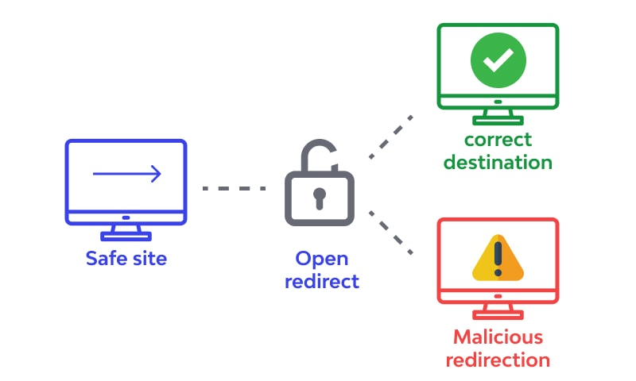

## ⚠️ Disclaimer

Este script foi desenvolvido **exclusivamente para fins éticos e educacionais**. Ele deve ser utilizado apenas em sistemas onde você tenha permissão explícita para realizar testes de segurança. O uso indevido ou malicioso deste script é **estritamente proibido** e pode resultar em consequências legais.

**Responsabilidade do Usuário**: Não me responsabilizo por qualquer uso indevido ou danos causados por sua utilização. Utilize-o com responsabilidade e sempre dentro dos limites da lei.

---

# 🛡️ Open Redirect Vulnerability Tester

Este é um script de segurança digital projetado para testar vulnerabilidades de **Open Redirect** em aplicações web. Ele verifica se um endpoint permite redirecionamentos não validados para URLs externas, o que pode ser explorado em ataques de phishing ou redirecionamento malicioso.



---

## 🚀 Como Funciona

O script realiza uma série de testes automatizados em um endpoint específico, verificando se parâmetros comuns de redirecionamento (como `redirect`, `url`, `next`, etc.) podem ser manipulados para redirecionar o usuário para um domínio externo (por exemplo, `https://google.com`).

### Principais Funcionalidades:
- **Teste de Parâmetros Comuns**: Verifica múltiplos parâmetros de query que podem ser usados para redirecionamento.
- **Suporte a URLs Codificadas**: Testa tanto URLs codificadas quanto não codificadas.
- **Detecção de Redirecionamentos 3xx**: Identifica respostas de redirecionamento válidas (códigos HTTP 3xx).
- **Relatório Detalhado**: Exibe um resumo dos testes realizados e vulnerabilidades encontradas.
- **Mensagens Coloridas no Terminal**: Utiliza formatação ANSI para melhor visualização dos resultados.
- **Wordlist Externa**: É possível carregar uma wordlist personalizada com parâmetros adicionais a partir de um arquivo `.txt`.
- **Execução Sequencial Aprimorada**: Testa os parâmetros de forma otimizada, garantindo resultados mais rápidos e eficientes.

---

## 🛠️ Como Usar

### Pré-requisitos
- [Node.js](https://nodejs.org/) instalado (versão 14 ou superior).
- [Git](https://git-scm.com/) (opcional, para clonar o repositório).

### Instalação
1. Clone este repositório:
   ```bash
   git clone https://github.com/ravenastar-js/open-redirect-tester.git
   ```
   Ou, se preferir, faça o download manual do repositório.

2. Instale as dependências: Execute o arquivo `install.bat` em (executar/install.bat)[executar/install.bat]

### Execução

Execute o arquivo `run.bat` em (executar/run.bat)[executar/run.bat]

---

### 💡 Adicionais

1. Caso queira alterar o site alvo, edite o arquivo `alvo.txt`, localizado em [target/alvo.txt](target/alvo.txt).
2. Se desejar testar parâmetros personalizados, edite o arquivo `params.txt`, localizado em [target/params.txt](target/params.txt), e adicione os parâmetros que deseja testar.

---

## 📝 Licença

Este projeto está licenciado sob a licença MIT. Consulte o arquivo [LICENSE](LICENSE) para mais detalhes.

---

Feito com ❤️ por [RavenaStar](https://github.com/ravenastar-js) | Segurança Digital

